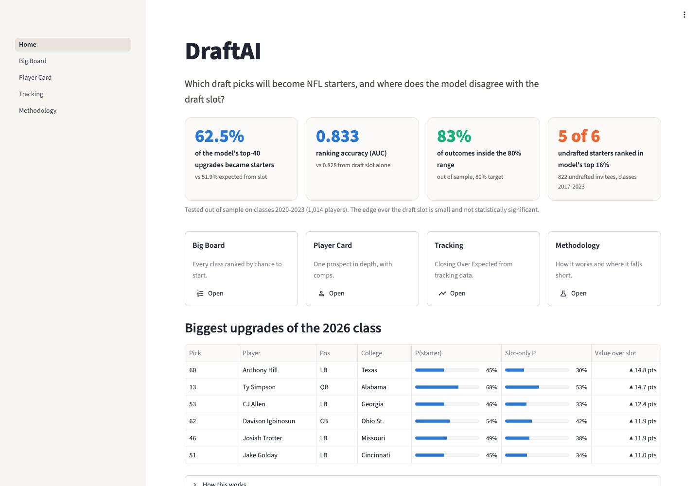
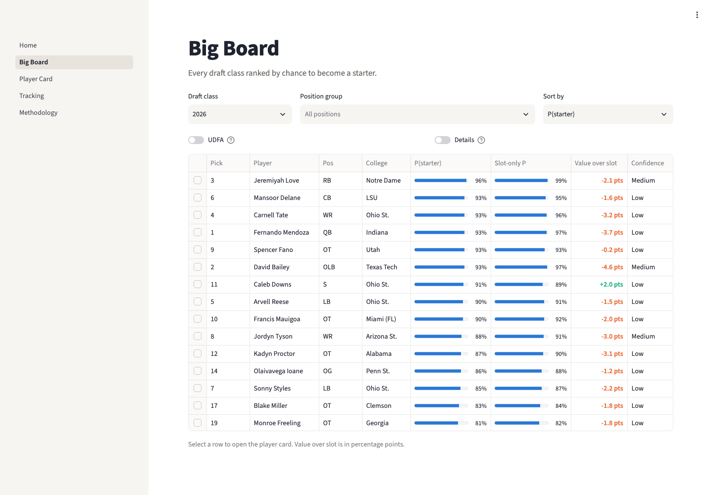
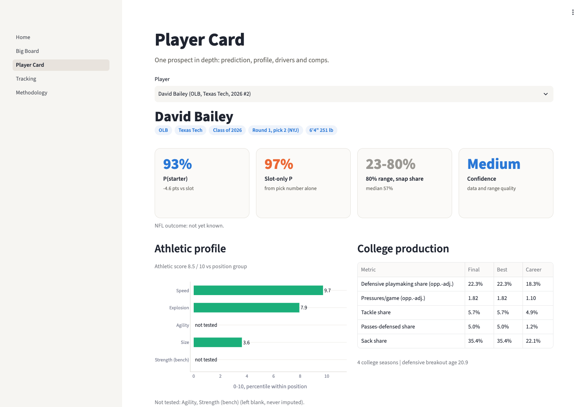
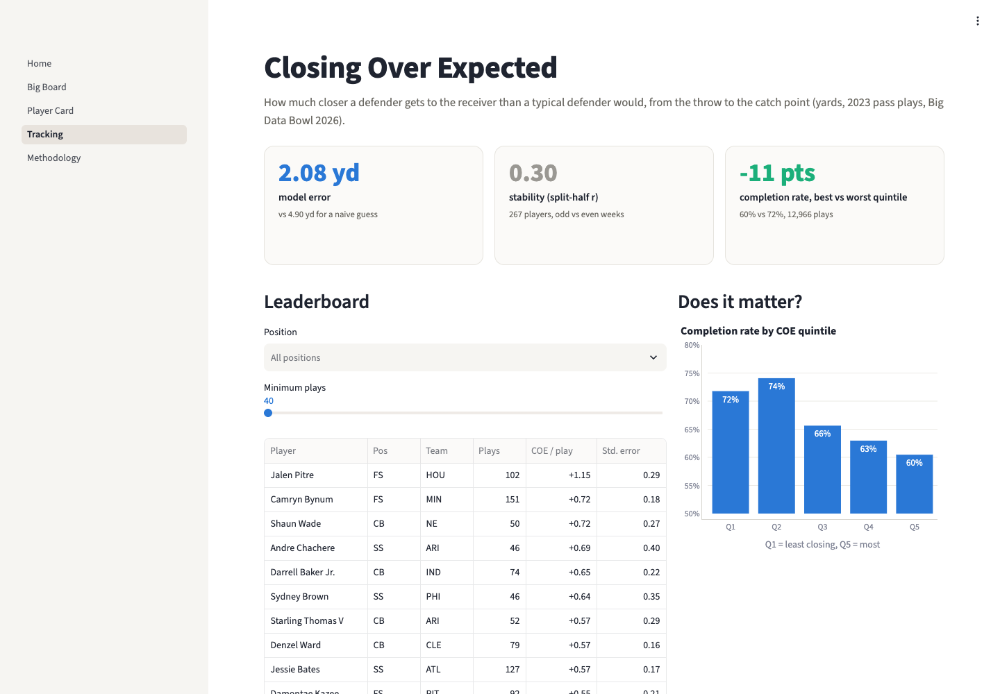

# DraftAI

**A second opinion on every NFL draft pick: who will become a starter, and when the draft board is probably wrong.**



  

## What it does

- **Rates every prospect** drafted since 2013, plus undrafted combine invitees. Each one gets a probability of becoming a starter and a likely range of playing time.
- **Flags disagreements with the board.** It shows where the model likes a player more or less than his draft slot implies.
- **Finds historical comps**: similar past prospects and how their careers actually went.
- **Measures coverage from tracking data**: how much ground a defender makes up while the ball is in the air.

## Results at a glance

All numbers come from draft classes the model had never seen. Each class was scored using only what was known on its draft night.

| | |
|---|---|
| **63%** | of the model's 40 biggest upgrades became starters. Their draft slot implied 52%. |
| **5 of 6** | undrafted players who became starters since 2017 were in the model's top 16% of their class. |
| **0.833** | AUC for picking starters, vs. 0.828 for draft slot alone. The market is hard to beat; the edge is in the disagreements. |
| **83%** | of outcomes landed inside the model's 80% range: honest uncertainty, not false precision. |


## Inside the app

| Big Board | Player Card |
|---|---|
|  |  |
| Every class ranked by chance to start, next to what the slot implies. | Athletic profile, college production, what drives the prediction, comps. |

| Tracking | |
|---|---|
|  | **Closing Over Expected.** 2023 NFL tracking data shows which defenders close on the receiver faster than expected while the ball is in the air. When the nearest defender is in the top fifth, 60% of passes are completed, against 72% in the bottom fifth. |

## How it works

1. **Collect.** NFL draft, combine and snap counts (nflverse), plus college stats (CollegeFootballData), all cached locally.
2. **Profile.** Size-adjusted athletic scores, plus college production adjusted for opponent strength and age.
3. **Predict.** Calibrated models trained only on past classes, blended with the draft slot, with an 80% outcome range.
4. **Compare.** Five nearest historical comps with known outcomes.
5. **Track.** A ball-in-air coverage metric from Big Data Bowl player tracking.

The full backtest is in [reports/backtest_2021_2023.md](reports/backtest_2021_2023.md), and the technical detail is in [docs/methodology.md](docs/methodology.md).

## Run it

```bash
make setup             # Python 3.12 venv + pinned requirements (macOS: brew install libomp)
cp .env.example .env   # add CFBD_API_KEY and KAGGLE_API_TOKEN
make all               # build data, models, comps, tracking and report
make app               # open the app at localhost:8501
```

## Honest limits

- Playing time favors high picks, because teams play the players they invested in. That makes the draft slot a tough baseline.
- No pro-day results, medicals, interviews or route data. That is where scouts still add the most.
- College defensive stats start in 2016, and offensive linemen have no production stats.
- The tracking metric covers one NFL season.
