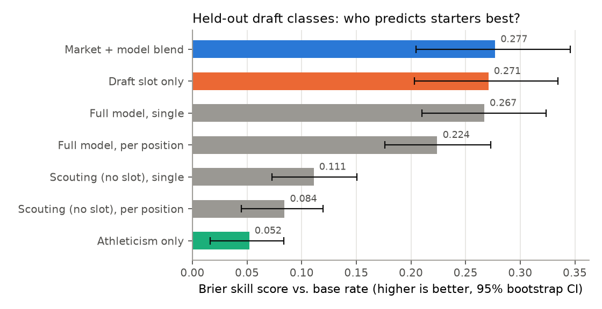
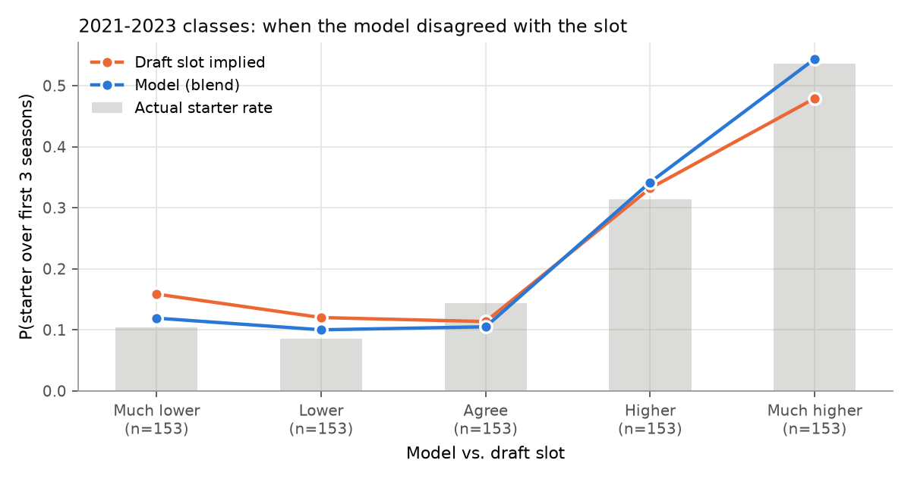

# Can public data beat the draft board? A backtest of the 2021–2023 classes

**Bottom line.** Once you know where a player was drafted, a model built on combine testing and college production adds only a small amount of information. That gain is not statistically significant. The edge is in *where* the model disagrees with the slot. Take the 40 players the model liked most relative to their draft position. The slot gave them a 52% chance to become starters, and 63% did. Its downgrades worked in aggregate: the fifth of players it marked down most started at 10.5%, against 16% implied by the slot. Its 40 most extreme downgrades, though, started at the slot rate (23%).

All numbers below are **as of draft night**. Each class was scored by models trained only on earlier classes whose three-year outcome was already known (class Y uses classes up to Y − 3). Model selection, blend weights and interval calibration follow the same rule.

## The question

*Starter* = the player averaged at least 50% of his team's offensive or defensive snaps over his first three NFL seasons. Seasons missed through injury, inactivity or release count as zero. Across 2021–2023, 24% of drafted players (excluding K/P/LS) cleared that bar.

## 1. The market is a very strong baseline

| Model (2020–2023 held-out classes, n = 1,014) | Brier | Skill vs. base rate | AUC | Calibration error |
|---|---|---|---|---|
| Draft slot only | 0.1294 | 0.271 | 0.828 | 0.036 |
| Athleticism only | 0.1683 | 0.052 | 0.664 | 0.038 |
| Scouting profile, no slot | 0.1578 | 0.111 | 0.721 | 0.029 |
| Full model (profile + slot) | 0.1301 | 0.267 | 0.824 | **0.025** |
| **Market + model blend** | **0.1283** | **0.277** | **0.833** | 0.042 |

- Without the slot, the scouting profile reaches about 40% of the market's skill. That is useful for players without a consensus grade, but it does not replace the board.
- The blend beats the slot alone by 0.0011 Brier (95% bootstrap CI −0.0008 to +0.0030; it wins in 87% of resamples). It is consistent, but not proven.
- A single model with position interactions beat one model per position group (Brier 0.130 vs. 0.138). Per-position samples (100–300 players) are too small for gradient boosting.

## 2. Where the model disagreed with the slot

The 765 players in the 2021–2023 classes are split into fifths by how far the model moved away from the slot.

| Model vs. slot | Slot implied | Model | Actual |
|---|---|---|---|
| Much lower | 15.8% | 11.9% | 10.5% |
| Lower | 12.0% | 10.0% | 8.5% |
| Agree | 11.4% | 10.5% | 14.4% |
| Higher | 33.2% | 34.2% | 31.4% |
| Much higher | 47.9% | 54.4% | 53.6% |

The model's downgrades went the right way in both lower buckets, and its strongest upgrades also did. The "Higher" bucket slightly underdelivered against both.

### Calls the model got right

| Class | Pick | Player | Pos | Slot P | Model P | 3-yr snap share |
|---|---|---|---|---|---|---|
| 2021 | 36 | Jevon Holland | S | 61% | 75% | 81% |
| 2021 | 34 | Elijah Moore | WR | 60% | 75% | 63% |
| 2022 | 59 | Ed Ingram | G | 51% | 65% | 79% |
| 2023 | 45 | Brian Branch | DB | 52% | 65% | 72% |
| 2021 | 86 | Wyatt Davis (downgrade) | OL | 40% | 31% | 1% |

### Calls the model got wrong

| Class | Pick | Player | Pos | Slot P | Model P | 3-yr snap share |
|---|---|---|---|---|---|---|
| 2022 | 13 | Jordan Davis (upgrade) | DT | 55% | 68% | 34% |
| 2021 | 53 | Dillon Radunz (upgrade) | T | 56% | 69% | 35% |
| 2021 | 226 | Trey Smith (downgrade) | OL | 15% | 7% | 97% |
| 2023 | 100 | Tre Tucker (downgrade) | WR | 21% | 14% | 68% |
| 2023 | 56 | Tyrique Stevenson (downgrade) | CB | 44% | 35% | 67% |

The misses have a pattern. Late-round players who became starters (Trey Smith, Tre Tucker) often slid for reasons public data cannot see, such as medicals or scheme fit. Rotational interior defenders like Jordan Davis can be excellent players while still falling short of a 50% snap share.

## 3. Draft round: the slot is over-confident at the top

| Round | Players | Slot implied | Model | Actual |
|---|---|---|---|---|
| 1 | 95 | 72.9% | 76.1% | 64.2% |
| 2 | 96 | 41.4% | 45.3% | 49.0% |
| 3 | 120 | 23.2% | 24.3% | 26.7% |
| 4–7 | 454 | 10.4% | 8.8% | 9.0% |

Round-one picks underdelivered against both the slot history and the model in these classes, while round two overdelivered. One cohort is not a trend. Still, it is the kind of signal worth monitoring when trading between rounds one and two.

## 4. Undrafted combine invitees

There is no slot for these players, so the question is whether the profile ranks them. Across the 2017–2023 walk-forward classes, 822 undrafted invitees have a known outcome, and 6 became starters.

| Class | Player | Pos | College | Model rank among that class's undrafted invitees | 3-yr snap share |
|---|---|---|---|---|---|
| 2018 | J.C. Jackson | CB | Maryland | top 9% | 60% |
| 2018 | Levi Wallace | CB | Alabama | top 16% | 56% |
| 2019 | Jakobi Meyers | WR | NC State | bottom 32% | 61% |
| 2020 | Terence Steele | OL | Texas Tech | top 11% | 81% |
| 2021 | Jerry Jacobs | DB | Arkansas | top 16% | 54% |
| 2023 | Ronnie Hickman | DB | Ohio State | top 12% | 55% |

- Ranks come from the out-of-sample full model, scored as of each draft night.
- Five of the six ranked in the top 16% (chance would put about one there).
- Beyond the starters the signal is thin. The model's top decile played 4.5% of snaps on average over three years, against 3.6% for the rest. 14% of them reached a 10% snap share, against 11%.
- Probabilities are low by design (0.9% predicted vs. 0.6% actual in 2020–2023). The list is a priority order for post-draft calls, not a set of likely starters.
- Jakobi Meyers moved from quarterback to receiver in college, so his production came late. Box-score features underrate that profile.

## What this means for a front office

1. Treat the model as a **second opinion that flags disagreements** with the board, not as a replacement for it. Its upgrades and downgrades carried real information in this backtest.
2. Read the probabilities literally: they are calibrated, with an expected calibration error of 2–4 points. The 80% snap-share ranges covered 83% of outcomes, so they are slightly conservative.
3. After the draft, use the undrafted ranking to order priority free-agent calls. Five of the six undrafted starters since 2017 sat in its top 16%.
4. The biggest gaps are information the model never sees: medicals, interviews, scheme, and true route/target data (YPRR). Those are where scouts add value on top of the model.

## Caveats

- Snap share carries a draft-capital feedback loop: high picks get playing time partly *because* they were high picks. That flatters the slot baseline.
- Undrafted players are covered only if invited to the combine, and six undrafted starters is a tiny sample. CFBD defensive stats start in 2016. Offensive linemen have no production stats, and 37% of drafted players lack a full combine testing profile.
- Four held-out classes is a small sample. The confidence intervals above are the honest summary.

*Reproduce:* `make all`. Numbers come from `artifacts/metrics.json` and `artifacts/report_2021_2023.json`.
