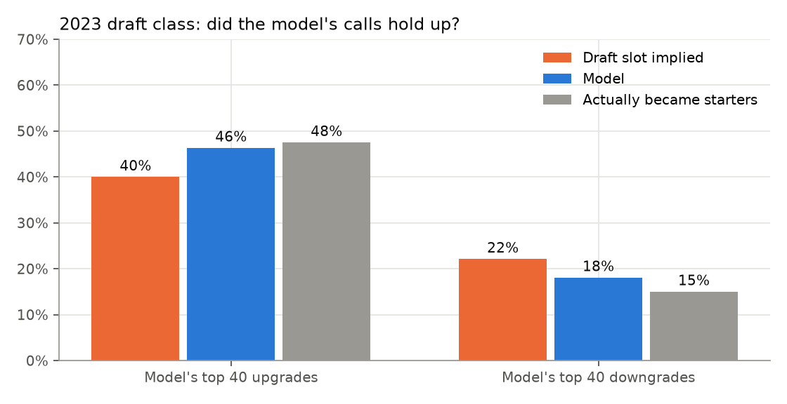

# The 2023 draft, three years later: what a model would have told you

*DraftAI scored the 2023 class as of draft night, using only classes whose outcomes were known by then (2013–2020). Three NFL seasons later, here is how its calls held up.*

**Starter** means the player averaged at least half of his team's snaps over 2023–2025.

## The short version

- The 40 players the model liked most relative to their draft slot became starters **48%** of the time. Their slot implied 40%.
- The 40 it liked least became starters **15%** of the time. Their slot implied 22%.
- Across the whole class the model beat the slot, but only slightly. The edge is in the disagreements, not the overall ranking.

## Calls it got right

| Pick | Player | Pos | Slot said | Model said | Snap share 2023–25 |
|---|---|---|---|---|---|
| 18 | Jack Campbell | LB | 67% | **77%** | 82% |
| 45 | Brian Branch | DB | 52% | **65%** | 72% |
| 48 | Cody Mauch | OT | 57% | **67%** | 70% |
| 57 | John Michael Schmitz | C | 51% | **62%** | 76% |
| 42 | Luke Musgrave (downgrade) | TE | 35% | **30%** | 31% |

Branch is the clearest case. He was the 45th pick with a coin-flip slot outlook. His college playmaking (tackle share, interceptions) and explosive testing pushed the model to 65%. He became an every-down defensive back.

## Calls it got wrong

| Pick | Player | Pos | Slot said | Model said | Snap share 2023–25 |
|---|---|---|---|---|---|
| 13 | Lukas Van Ness | DL | 49% | **62%** | 32% |
| 51 | Cam Smith | DB | 47% | **54%** | 5% |
| 56 | Tyrique Stevenson (downgrade) | CB | 44% | **35%** | 67% |
| 100 | Tre Tucker (downgrade) | WR | 21% | **14%** | 68% |

The misses have a pattern. Rotational edge players like Van Ness can be useful without clearing a 50% snap share. Mid-round players who earned the job, like Stevenson and Tucker, often did it for reasons public data cannot see: scheme fit, development and opportunity.

## The one everybody missed: Puka Nacua

Pick 177 became one of the best receivers in football. The model missed him too: it gave him **10%**, the same as his slot.

- His strongest signal was there: a receiving breakout at 19, the biggest positive in his profile.
- He did no drills at the combine, and pro-day results are not in the public data.
- His final college season was cut short by injury, so his last-year production looked ordinary.

We tried a fix: production per game actually played, from every college box score. It saw the injury. It didn't move him. That is the blind spot in one player. When the data is thin, the model falls back on the slot, and the slot was wrong. Among 2023's late-round receivers, the model still ranked him 4th of 16 against his slot.

## The undrafted find

Ronnie Hickman (Ohio State) went undrafted. Among that year's undrafted combine invitees, the model ranked him in its **top 12%**. He averaged 55% of his team's defensive snaps over three years, and 95% by 2025.

## What it means

- **Use it as a second opinion.** When the model and the board disagree by 10+ points, that player deserves another look.
- **Don't use it as a replacement.** Medicals, interviews and scheme fit are where scouts still win.
- **One class is a small sample.** The [full backtest](backtest_2021_2023.md) covers 2021–2023 and comes to the same conclusion.

*Reproduce with `make all`. The numbers come from `marts.predictions` and `artifacts/report_2021_2023.json`.*
